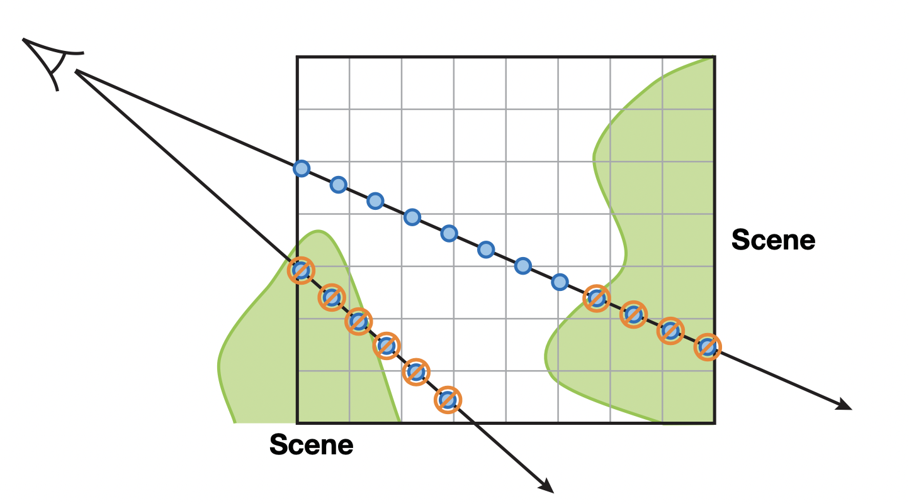

# 3D Fluid Simulation in OpenGL

###### Implementation and discussion of real-time simulation and rendering tecniques for 3D fluids.

Vincenzo Lombardo - 978383,

January 5, 2023

------

### Abstract

This project is based on the approach presented by Crane, Llamas, and Tariq for real-time simulation and rendering of 3D fluids. The main focus was on liquid and gas/smoke simulation, but the code developed is as modular as possible, allowing it to be extended to other fluids or similar effects such as fire. 

The objective of the following report is to explain the algorithms used for simulation and the techniques adopted for rendering, including the system for handling dynamic obstacles and how they can interact with fluids.

------

### How to build and run

This project should offer the needed libraries and their include files for all platform (Windows and Mac on both architectures).

Before building the project, please decompress Assimp library zip files located in the following folders:

```
libs/mac-arm64/libassimpd.a.zip

libs/mac-intel/libassimp.a.zip
libs/mac-intel/libassimpd.a.zip

libs/win/assimp-vc143-mt.lib.zip
```

It was necessary to publish them as a zip files due to the original size exceeding GitHub's limit. Once done you can proceed with building.

NB: You can avoid decompressing files for platforms other than your own. 

#### Mac Intel

To build the project, run the following command inside the project's folder:

```
make -f MakefileMac-intel
```

This command should look up for its platform-specific files and build the application by creating the ` 3d-fluid-simulation.out` file.

To run the application, simply run the command:

```
./3d-fluid-simulation.out
```

#### Mac ARM64 (Apple Silicon)

To build the project, run the following command inside the project's folder:

```
make -f MakefileMac-arm64
```

This command should look up for its platform-specific files and build the application by creating the ` 3d-fluid-simulation.out` file.

To run the application, simply run the command:

```
./3d-fluid-simulation.out
```

#### Windows

Dependency: Visual Studio

To build the project you simply need to double click on the ` MakefleWin.bat` file, and the terminal will automatically call Visual Studio's `nmake` to run the makefile and compile the project.

Once completed, you should see the ` 3d-fluid.simulation.exe` file. To run the application, just double click on it.

### Controls

* Once the application is running, you are able to freely move with WASD for the position, mouse for view direction, LEFT SHIFT to going down, and SPACE for going up.

* To open/close the GUI controls menu, simply press the M key.

* You are also able to change the obstacles rotation speed with LEFT ARROW to decrease, and RIGHT ARROW to increase.

* To stop/resume the obstacles rotation you can press the P key.

All the other controls, such as for the simulation and for the obstacles, are available in the GUI controls menu.

------

# Report

### Introduction

Computer simulation of physical phenomena has always been one of the most discussed topics in the field of computer graphics, particularly those that are extremely unpredictable and complex to study. Various techniques have been presented for years, and even today the most realistic solutions are only accessible to off-line rendering because of the high computational cost.

Among the most difficult phenomena is certainly the simulation of fluids: just calculating their evolution is an arduous task because of the high order equations describing them and the resulting problem of "how to discretize them?" in order to solve them in computer calculation without high errors and unstable results. 

Due to hardware limitations, fluid simulation had to undergo many approximations before we were able to successfully achieve the goal, even more so when we start talking about real-time computation. As mentioned earlier, this type of task has usually been studied and improved only for off-line rendering, in a context where the high computational cost is something that can be put on the back burner. 

In 2004, Harris et al. succeeded in developing and presenting a 2D fluid simulation and rendering in the article "Fast Fluid Dynamics Simulation" that exploited the computational power of GPUs by adapting the mathematical equations of fluid dynamics to a highly parallelizable algorithm that could be run through the Rendering Pipeline, allowing them to create a real-time application with much greater efficiency than similar proposals still run on CPUs. Their work was based on the milestone in this field proposed by Stam in 1999 under the name "Stable Fluids Simulation," but the main feature was the successful conversion of his CPU techniques into a faster and more efficient parallel version based on GPU computing. 

Harris's work was so promising that his approach could be easily adapted to higher dimensions, in addition to the 2D version he presented, as explained in his paper; however, due to the lack of powerful machines, it was difficult to obtain a good representation of 3D fluids. In 2007, Crane et al. presented a viable approach to simulation and real-time rendering of 3D fluids based on Harris's, using it even in a more complex context such as a game (*Hellgate: London*). In their paper they explained what optimizations and techniques they used to convert Harris' approach for 2D fluids into three dimensions, resulting in a more accurate simulation without affecting the common problem of high computational cost for the task.

In this paper we will explain Harris's original work and discuss Crane's adaptation along with the proposed implementation and the developed features. Speaking of the latter, the presented application offers a glimpse of Crane's approach for gas and liquid simulation, along with features for interacting with fluid through obstacles in the scene and emitters for wind and fluid. 

------

### Fast Fluid Dynamics Simulation

In order to fully understand the logic of the proposed approach by Harris, we must talk about the equations considered, and how they have been solved to develop the GPU algorithms. First of all, the best way to represents its state at any time is through the most important proprierty of fluids: the *velocity*; it is discretized by using a vector field, which is a vector-valued function into a parametrized space such as a Cartesian grid. Thanks to this definition we can map every position $\vec x = (x,y)$ (bidimensional due to 2D simulation, but easily extendible to any dimensional space), along with an associated time $t$, to a vector $u(\vec x, t) = \vec u$. 

Since we cannot store and maintain an entire grid for each time, the key to simulate fluids is to update the fields at each time step to determine the current state of them and describe their evolution over time.

#### Navier-Stokes equations

The purpose of having a correctly simulated velocity field of a fluid is that we can describe the fliud behavior through it by using the Navier-Stokes equations for incompressible and homogenous flow, which are fluid dynamics equations based only on the velocity field thanks to the defined assumption: the simulated fluid volume must be constant in any of its sub-region at any time, and its density $\rho$ must be constant in space. With these constraints in simulation, our fluid will be correctly represented by the vector velocity field $u(\vec x, t)$ and a scalar pressure field $p(\vec x, t)$ if their state for the initial time $t = 0$ is known. The evolution of the fluid is described with the following Navier-Stokes equations:

```math
\begin{cases}
\frac {\partial \vec u} {\partial t} = 
- \underbrace{ (\vec u \cdot \nabla) \vec u }_{\text{advection}}
- \underbrace{\frac 1 \rho \nabla p }_{\text{pressure}}
+ \underbrace{\nu \nabla ^2 \vec u }_{\text{diffusion}}
+ \underbrace{\vec F}_{\text{external forces}}
& \qquad (1) \\
\nabla \cdot \vec u = 0
& \qquad (2)
\end{cases}
```

where $\rho$ is the constant fluid density, $\nu$ is the kinematic viscosity and $\vec F$ represents any external forces that act on the fluid.

As hinted in the equation $(1)$, it is composed by different factors, each representing a particular property of the fluid, and this possibility allows to split the computation of the simulation into a sequence of simpler tasks, describing a sort of pipeline: 

1) **Advection**: the velocity of a fluid causes the fluid to transport (to *advect*) objects, densities and other quantities along the flow, but the fluid itself is carried by the flow causing the phenomenon called *self-advection*, that is the event of the fluid's velocity influcenced by the movement and evolution of itself.
2) **Pressure**: because the molecules of a fluid can move and push each other, when a force is applied to the fluid it does not propagate through the entire volume, but is initially applied to the molecules near the area of force and then they will spread the force by pushing other molecules, resulting in an increase in pressure that causes an acceleration in the velocity field. The term in the equation that represents this acceleration is the one submitted.
3) **Diffusion**: fluids can behave differently depending on their *viscosity*, which represents how resistive the fluid is to flow, and exactly this resistance results in diffusion of the *momentum*. This is the meaning of the diffusion factor in equation.
4) **External Forces**: fluids can be subjected to external factors, such as application of local forces (like the blowing of wind) for specific regions, or body forces (like gravity) that are applied to the entire fluid. In the equation, the external forces factor means the contribution of all those forces to the evolution of the fluid over time.

In the presented equations, the operator $\nabla$ (nabla) assumes various meanings depending on the context it is used as shown below. Also, because we are handling with discretization of differential equations, we are adopting the finite difference approximation of derivatives to solve them with an easy implementation and fast computing.

- **Gradient**: in the pressure term of the equation $(1)$, the $\nabla$ operator is used to describe the gradient of the pressure field $\nabla p$, which for a scalar field is equal to a vector composed by its partial derivatives.

```math
\nabla p = \left( \frac {\partial p} {\partial x}, \frac {\partial p} {\partial y} \right) = 
\left( \frac {p_{i + 1,\ j} - p _{i - 1,\  j}}{2 \ \delta x} , \frac {p_{i,\ j + 1} - p _{i,\  j - 1}}{2 \ \delta y} \right)
```

  where $\delta x$ and $\delta y$ are the size of the grid cells.

- **Divergence**: in the equation $(2)$ the $\nabla$ operator represents the *divergence* of the fluid, and is the rate at which fluid's density exists in a given region of space. Because we are applying it to a velocity field, it measures the net change in velocity across a surface surrounding a small piece of fluid, and the defined Navier-Stokes equation $(2)$ describes the incompressibility assumption by defining the divergence of fluid to be always equal to zero. Due to dot product, the divergence operator can be applied only to a vector field, and results in a sum of partial derivatives.

```math
\nabla \cdot \vec u = \frac {\partial u} {\partial x} + \frac {\partial v} {\partial y} = 
\frac {u _{i + 1,\ j} - u _{i - 1,\ j}} {2 \ \delta x} +
\frac {v _{i,\ j + 1} - v _{i,\ j - 1}} {2 \ \delta y}
```

  where $\vec u = (u, v)$ is a velocity vector.

- **Laplacian**: computing the divergence to the results of the gradient operator leads to the Laplacian operator $\nabla ^2$, which is commonly used in physics in the form of diffusion equation, such as the heat equation. The Laplace equation is originated from the Poisson equations of the form $\nabla ^2 x = b$, where $b = 0$, and represents the origin of the Laplacian operator. When the Laplacian operator is applied to a vector field composed by squared grid cells, it can be simplified to the following formula:

```math
\nabla ^2 p = \frac {p_{i + 1,\ j} + p_{i - 1,\ j} + p_{i,\ j + 1} + p_{i,\ j - 1} - 4 p_{i,\ j}} 
{(\delta x) ^2}
```

  To simplify the calculation, the operator can be applied separately to each component of the vector field, resulting in the following form: 

```math
\nabla ^2p = \frac {\partial ^2 p} {\partial x ^2 } +
\frac {\partial ^2 p} {\partial y ^2 } = 
\frac {p_{i + 1,\ j} - 2p_{i,\ j} + p_{i-1,\ j}} {(\delta x)^2} + 
\frac {p_{i,\ j + 1} - 2p_{i,\ j} + p_{i,\ j-1}} {(\delta y)^2}
```

##### Solving the equations

In order to satisfy the zero divergence condition of the Navier-Stokes equation $(2)$, we must apply the *Helmholtz-Hodge Decomposition Theorem* to decompose the vector velocity field in a sum of vector fields, which one of them is divergence free and what we are interested for. The theorem states the following:

> Let $D$ be the region in space (or plane), on which the fluid is defined. Let this region have a differentiable boundary $\partial D$ with normal direction $\vec n$, a vector field $\vec w$ on $D$ can be uniquely decomposed in the form:

> ```math
> \begin {align}
> \vec w = \vec u + \nabla p &&&& \qquad (3)
> \end {align}
> ```

>  where $\vec u$ has zero divergence and is parallel to $\partial D$, that is $\vec u \cdot \vec n = 0$.

Since the simulation pipeline obtained from the factorization of the equation $(1)$ results in a vector field $\vec w$ with nonzero divergence, thanks to this theorem we are able to correct it by subtracting the gradient of the resulting pressure field:

```math
\vec u = \vec w - \nabla p
```

Also, we can define a formula to calculate the pressure field from the equation $(3)$ by appling the divergence operator to both members, resulting in the following:

```math
\nabla \cdot \vec w = \nabla \cdot (\vec u + \nabla p) = \underbrace{\nabla \cdot \vec u}_{= \ 0} + \nabla ^2p \ \implies
\nabla ^2 p = \nabla \cdot \vec w
```

which we know to be a Poisson equation, called *Poisson-pressure equation*.

To solve the equation $(3)$ and find a method to calculate $\vec w$, we define a projection operator $\mathbb{P}$ based on the Helmholtz-Hodge theorem as following:

```math
\mathbb{P}\vec w = \vec u \ | \ 
\nabla \cdot \vec u = 0
```

where $\vec w$ is a vector field, and $\vec u$ is its divergence-free component.

Applying the projection operator to the equation $(1)$ we are able to obtain a differential equation that results in a divergence-free velocity field, and describes the entire simulation algorithm we need:

```math
\underbrace{\mathbb P \frac {\partial \vec u} {\partial t}} _{ = \frac {\partial \vec u} {\partial t}}
= \mathbb P \left( 
- (\vec u \cdot \nabla ) \vec u 
- \underbrace{\frac 1 \rho \nabla p }_{\mathbb P (\nabla p) = 0}
+ \nu \nabla ^2\vec u 
+ \vec F \right)
\\
\begin{align}
\frac {\partial \vec u} {\partial t} 
= \mathbb P \left( 
- (\vec u \cdot \nabla ) \vec u 
+ \nu \nabla ^2\vec u 
+ \vec F \right)
&&& \qquad (4)
\end{align}
```

Equation $(4)$ let us solve the Navier-Stokes equation $(1)$ to obtain a vector velocity field which is divergence-free, that satisfies the assumtions we defined for our simulation. Also, suggests a new simulation pipeline for our goal composed by the following steps:

1. Advection of the current velocity field $ \vec u(t)$ 
2. Calculation of the viscous diffusion 
3. Application of external forces
4. Projection of resulting vector field $\vec w$ to obtain the divergence-free velocity field at next time step: $\vec u(t + \delta t)$

We now need to explicitely define the equations for each of these steps, in order to convert them into algorithms.

##### Advection

Being the advection the process by which the velocity of a fluid transports itself and other quantities, this operation results in a sort of movement for each particle of our fluid in the grid, where a single cell grid represents a fluid particle. It would be legitimate to think solving this problem through forward Euler's method, obtaining an equation of the following form:

```math
\vec r (t + \delta t) = \vec r(t) + \vec u (t) \delta t
```

However, this kind of method is not spendable for this particular task not only because is extremely susceptible and unstable for large time step, which will harm the flexibility and determinism of the algorithm, but also is unrealizable from a GPU point of view due to the constraint of shaders to fixed fragments, leading to the impossibility to write over a different location than the initial one. As solution for this problem we refer to the algorithm proposed by Stam, which suggests to update each particle not forward but back in time, by copying the quantity of the estimated position of each particle in the previous time step.

```math
u(\vec x, t + \delta t) = u (\underbrace{\vec x - u(\vec x , t)\cdot \delta t}_{\text{previous position}}
, \ t)
```

<figure align = "center">

<figcaption><b>Fig.1 - Estimation of the particle's position in previous time step.</b></figcaption>
</figure>


##### Viscous Diffusion and Pressure

In a similar way of advection, viscous diffusion cannot be solved by simply adapting the differential equation to forward Euler's method, so we directly start our observations from Stam's proposal:

```math
(\boldsymbol I - \nu \delta t \nabla ^2) \  \vec u (\vec x, t + \delta t) = \vec u (\vec x, t) 
```

where $\boldsymbol I$ is the identity matrix.

This equation can be treated as Poisson equation for velocity, and so we can introduce an iterative relaxation technique to approximate its solution. These equations are of the form $\boldsymbol A \ \vec x = \vec b$, where $\boldsymbol A$ is a matrix, $\vec x$ is the vector we need, and $\vec b$ is a vector of constants. A very simple but effective iterative solution technique is the so-called *Jacobi iteration*, that is able to solve Poisson equations with some easy-to-compute calculation (even lighter in computation when executed by GPU), which is discretized using the Laplacian operator in the following form: 

```math
x_{i,j}^{k + 1} = 
\frac { x_{i-1,\ j}^{k} + x_{i+1,\ j}^{k} + x_{i,\ j-1}^{k} + x_{i,\ j+1}^{k} +\alpha\  b_{i,j} }
{\beta}
```

 where $\alpha$ and $\beta$ are constants and $k$ is the iteration number. In the case of Poisson equation for velocity, those constants and variables assume the values of:

* $x$ and $b$ are both represented by the velocity field $\vec u$
* $\alpha = (\delta x)^2 / \nu \delta t$, where $\delta x$ is the size of the grid cells
* $\beta = 4 + \alpha$

Otherwise, if we are solving the Poisson-pressure equation, the constants and variables assume those values:

* $x$ represents the pressure
* $b = \nabla \cdot \vec w$, which is the divergence
* $\alpha = - (\delta x) ^2$, where $\delta x$ is the size of the grid cells
* $\beta = 4$ 

In order to obtain a good quality solution, the Jacobi iteration technique usually requires a number of iterations from 40 to 80, even though thanks to its cheap cost increasing the iterations doesn't affect that much in terms of total computational cost. As alternative, there may be some sort of additional approximation to simulation pipeline that allows to get a compromise with simulation quality by reducing the number of Jacobi iterations (as we will see for liquid simulation later); otherwise, more efficient and fast to converge techniques exist but are more difficult to develop and integrate in the computation. For the sake of simplicity, Jacobi was chosen in this project. 

#### Implementation

Before converting all the discussed equations in the form of algorithms to code we must be discuss some observations about how do we manange their execution and handle the values. Harris' approach for developing these algorithms in the GPU begin with defining the value management: Since the goal of the research was to create a 2D fluid simulation, the best way to handle the values is with textures, which are used as two-dimensional grids analogously to a multidimensional CPU array. Because we are defining Cartesian grids where the indices of its positions are integers, when moving to GPU implementation where we use textures as grids, we are implicitely defining that the values in the fields are located in the center of each grid cell to avoid interpolation and reduce the errors.

To implement and execute the various operations, we use *fragment programs* to perform those calculations that define the algorithm we want to code. By drawing a full-screen quad as rendering geometry, and setting the simulation grid resolution as rendering viewport, we are able to obtain a *SIMD* (Single Instruction Multiple Data) programming model, where each fragment generated from the rendering pipeline can be mapped to a pixel of the data texture, and so to a simulation grid cell. Basically we can perform the operation we described in the algorithms for each cell through the GPU rendering pipeline thanks to this method. In practice, each algorithm is implemented as a *shader* program, and called every time we need to perform its calculation.

Because the GPU cannot manage the same source as input and output buffer, we cannot use the same texture to read values and write the output. There are two GPU techniques that can help us: *Copy to texture* (CTT), which copies the values from the output framebuffer to a texture, or *Render to texture* (RTT), where the GPU can directly write into a texture. However, both require an auxialliary buffer and there we define the chosen modus operandi: when performing operations, we set the current data texture as input and an additional temporary buffer as output buffer; then we swap them by renaming the buffer used as output as our data texture for the next stage, resulting in a sort of "*ping-pong*" between textures.

------

### Simulation and Rendering of 3D Fluids

As introduced above, years later the work proposed by Harris will be expanded by Crane et al. which were able to bring to reality with a complete and fully described approach what Harris theorized in this research, that is the simulation of fluids in three dimensions.

Because the core of the simulation is basically the same of the 2D version, we are going to discuss the main features Crane implemented to extend the approach to 3D, both in simulation than, in a more consistent way, in rendering. This last topic is particularly interesting because, compared to Harris' in which we only need to implement and evolve a density field where we add a dye to advect in the simulation and that represents the display color to show on screen, having now a volume requires more sofisticated techniques.

#### Simulation: from 2D to 3D

In a similar way Harris introduced a discretized Cartesian grid for its simulation domain, Crane used an Eulerian discretization to define values fixed in time that belong to the subdivision of a regular volume into a regular grid of cubical cells. As the fields used in 2D simulation, here we are using these grids to store vector and scalar quantities. 

The grids introduced in 3D simulation are pratically defined in GPU as 3D textures because of the straighforward mapping between grid cells and texture's *voxels* (the 3D analogue to 2D pixels). Also, the values in discretized space are going to be stored in the voxels centers, similarly to what happens in Harris' textures.

Each field (such as velocity, pressure, density and so on) is stored in a 3D texture, and the simulation is executed through the so-called *kernels*, which are GPU shader programs: a set of instruction to compute for each cell of the grid. Here we have to talk about the first obstacle: GPU rendering pipeline is able to only handle 2D buffers, resulting in the impossibility to directly render to a 3D texture (or at least with DirectX 10, the graphics library used by Crane, or OpenGL 4.10 Core, the one used for this project). To solve this problem there are two different solutions that can be adopted: 

* *Iterative rendering* over slices: the 3D textures can be considered as a sequence of 2D textures, called *slices*, which can be selected independently and used as output buffer; to render in the entire texture we can iteratively select the slices as framebuffers and execute the kernels for each of them.
* *Layered rendering*: 3D textures can be entirely used with a single drawcall thanks to the *Instancing* technique, which allows to define multiple rendering pipeline instances that can be used to divide the computation along all the slices, one for each instance, in a single kernel execution; the layered rendering, that actually is the multi-drawing into all slices of a 3D texture, can be enabled by setting the global variable exposed in the *Geometry Shader*, an optional programmable rendering stage capable of manage the vertex data received from the Vertex Shader in form of primitives (points, lines or triangles), and output a custom geometry based on the required operation which will be rasterized and drawn in the next stages of the pipeline. This exposed variable called `layer_ID` (in OpenGL) can be set to the ID of the current instance: creating a number of instances equal to the number of slices of the texture will results in the execution of the kernel for each cell of the simulation grid. 

As mentioned above, the major difference between these approaches lies in the number of drawcall needed: in the case of iterative rendering, as can be imagined, a single drawcall will execute the kernel only for the selected layer of the texture. While, with layered rendering we can perform the operation with a single call, resulting in optimizations. For this reason, in this project the implemented approach is the last one, decision strongly supported to the absence of different tasks for specific subregion of the simulation grid.

Back to the fluid dynamics, in Crane's approach for fluid simulation the operation to perform are basically the same of Harris: we split the equation into simpler tasks, executed with a specific order and applied to the entire field. The simulation pipeline is than composed by: advection, application of external forces and pressure projection. Notice the absence of the viscous diffusion step compared to Harris' approach, it was removed from the equation for two main reasons: 

* Small contribution in the fluid's evolution: in the proposed implementation, that is based on Crane's approach for the simulation pipeline, can be observed that even without viscous diffusion applied to the velocity field, the fluid still moves and evolves with good results
* Worst performance: because the viscous diffusion is defined by a Poisson equation it can only be solved by another Jacobi iteration, that is probably the most costly operation in the entire simulation pipeline, so introducing also this step would leads to expasive costs and reduce the general performance in the application. Reason why it was preferred to cut it in favour of most sofisticated and efficient methods, such as an higher order solver for the advection step which we are going to discuss next.

##### A different advection

As just anticipated, the removing of the viscous diffusion step in simulation pipeline was a logic decision in order of moving the priority of fluid's evolution details to a more complex and efficient solution for the advection step: the introduction of a new solver called *MacCormack scheme*, proposed by *Selle et al*. in 2007. This algorithm, being an higher order equation, is based on adapting the previous semi-Lagrangian scheme used by Harris and previously presented by Stam, as a building block to a more precise solver that combines intermediate steps computed with it. In particular the MacCormack scheme is composed by three steps: 

1. *Predictor step*: we are computing the advection the classic way, we are "moving" the fluid particles by estimating the previous position from the current.

```math
\hat \phi ^{t + \delta t} = A(\phi ^t)
```

2. *Corrector step*: based on the resulting field of the previous step, we are now trying to approximate the value in the initial time $t$ from the advected field $\hat \phi ^{ t + 1}$, by using a negative time step.

```math
\hat \phi ^t = A^R(\hat \phi ^{t + \delta t}) = w (\underbrace{\vec x + u(\vec x , t)\cdot \delta t}_{\text{future position}}, \ t)
```

   where $w$ is the field from the predictor step, and $u$ is the velocity field.

3. The last step is the calculation of the final advection values, obtained by correcting the values from the first step $\hat \phi ^{t + \delta t}$ with the average of the initial field $\phi ^t$ and the one from the second step $\hat \phi ^t$.

```math
\phi ^{t + \delta t} = \hat \phi ^{t + \delta t} + \frac {\phi ^t - \hat \phi ^t}{2}
```

However, compared to Stam's semi-Lagrangian scheme, this MacCormack scheme is not unconditionally stable, and there may be cases where the simulation blows up. To solve this problem we introduce a clamp to the resulting value from the advection, in order to ensure it falls within the range of the values that contribute to the semi-Lagrangian scheme: we find the minimum and maximum values in the neighborhood of the estimated position by sampling the input field $\phi^t$ exactly at their voxel centers to avoid interpolated values. 

One of most interesting feature offered by the MacCormack advection scheme is the quality of details the simulation even with low resolution grids, resulting in an increasal of performance thanks to the possibility of lowering the size of the grid without ruining the fluid simulation, thing that would happen using the previous semi-Lagrangian scheme.

#### Solid-fluid interaction

Probably the most interesting feature in Crane's work is a set of methods to introduce an effective and realistic interaction between the simulated fluid and objects in the scene. Related to the time their research was published, it was an innovation because this kind of interaction was basically only present in precomputed animations and offline rendering, and similar proposes and studies on this topic were rare to find.

Harris, in his work, also discussed about the interaction of fluids with solids, and in particular about the effect of "fluid in a box", but is only referred to static and geometrical objects. Crane, on the other hand, proposed some approaches to this problem that are able to track dynamic objects in the simulation grid and evolve the fluid taking them into account.

Before discussing the methods, we need to make a statement: we need to distinguish the limits of the simulation grid with the actual region of space where the fluid can evolve. To explain this last concept, we are going to define the so-called *fluid domain*, which refers to the region of grid actually occupied by the fluid. 

To understand how to handle with fluids in complex dynamic domains we need to observe the *domain boundaries*, that are the cell faces between a fluid cell and a solid cell. The most simple example of domain boundaries is the one also discussed by Harris: barriers placed around the perimeter of the simulation grid that prevent the fluid from simply flowing out (those that create the already mentioned "fluid in a box" effect).

In order to define an actual interaction between solid and fluid, we need to impose a condition called *free-slip*, applied along the domain boundaries, and assures that the velocities of the fluid and the solid are the same in the direction normal of the boundary, that is the limitation of a fluid to flow through solids but to flow along their surfaces. This condition is expressed by the following equation:

```math
\vec u \cdot \vec n = \vec u _{\text {solid}} \cdot \vec n
```

Because the introduction of the free-slip boundary condition changes affects the pressure equation, we need to apply it to the previous pressure equation proposed by Harris and discretize the result, obtaining the following form: 

```math
\frac {\delta t} {\rho (\delta x) ^2}
\left( \left|F_{i,j,k}\right|  p_{i,j,k} - \sum_{n \in F_{i,j,k}}p_n \right)
 = - u_{i,j,k}
```

where $F_{i,j,k}$ is the set of indices of cells adjacent from the current one.

In practice, to implement this equation we cen simply introduce a condition every time we sample the pressure from a neighboring cell: if the neighbor is a solid obstacle, we set its pressure to the one of the current cell, nullifying its contribution to the new pressure equation. The same solution can be applied to the velocity solver when looking for the neighborhood.

Because the pressure solver is iterative and usually never reaches to convergence, we enforce this condition during the pressure projection kernel, right after the calculation of the new velocity field, for the fluid cells next to the domain boundary. This happens by computing the obstacle's velocity component in the direction normal of the boundary, and replacing this value to the corresponding component of the fluid velocity at the center cell. This operation can be simply applied by selecting the vectors components because the boundaries are aligned with the voxel faces, which are axis aligned.

In the end, to complete the implementation of obstacles we are also introducing a constraint in the advection step due to the possible fluid leaks when using large time steps. This constraint ensures that the advected value for those grid cells that belong to obstacles are always zero. This solution was also adopted by Harris in his approach by the name of *no-slip condition*.

#### Voxelization of dynamic obstacles

As mentioned above, in order to apply the boundary conditions to fluid simulation, we need a way to determine if a cell is occupied by fluid or solid. To solve this problem, Crane proposed an algorithm to describe any dynamic obstacle inside the simulation grid in terms of voxels, obtaining a representation of them in a 3D grid. This algorithm is called *Inside-Out Voxelization*. The result of this method is a binary 3D grid where each cell is equal to $1$ if occupied by the obstacle, $0$ otherwise, representing the *position* of the obstacle inside the grid.

This algorihm is inspired by the *Stencil Shadow Volume* algorithm, which is a shadowing technique that takes advantage of the GPU *stencil buffer* to determine whenever a pixel is shadowed or not.

The stencil buffer is used in the rendering pipeline to execute the *Stencil Test*, that is an optional mask used to control the fragment color output produced by the current rendering before they are written in the output buffer. The stencil buffer can be modified through predefined *operations* offered by the GPU, and the fragments allowed to edit the stencil are decided with predefined *functions*. The Stencil Test can be used along the *Depth Test* to distinguish the three cases and set different operation based on the success or fail of both tests (both fails, depth succeed but stencil fails, both succeed).

To implement the Inside-Out Voxelization we exploit the stencil operation of increment and decrement based on front or back facing fragments. In order to handle only the obstacles inside the simulation grid and obtain a representation along all the slices of the output 3D texture, we are drawing its mesh by using an orthogonal projection with far plane set to inftyity (or a large value), and the near plane equal to the depth of the current slice of the texture, while the frustum is set to extend from origin to any direction by half the edge of the simulation cube. With these settings we are creating an orthogonal projection with the exact size of the simulation cube.

In the proposed implementation, the projection is defined from a camera with front direction aligned with the negative Z axis (assuming the OpenGL axis reference), and positioned in front of the simulation cube at one unit of distance. This particular positioning of the camera is due to a 3D texture convention that its depth would be along the negative Z axis. 

Because the algorithm needs to set the projection near plane to the depth of each slice, thanks to instancing we can update the projection matrix in the Vertex Shader by recalculate those elements related to far and near planes. The near plane depth is computed from a segment from a point in the first slice plane to a point in the last slice plane, both along the camera front direction (which is the "axis" of the simulation cube): from it we are able to calculate a point that belongs to the current slice plane.

The algorithm is composed by the following steps:

1. Set the stencil operation to increment for back-facing fragments, enable the *Face Culling* to draw only the back faces, set as stencil function to always pass the Stencil Test and disable the writing in color buffer. With this step we are increasing the stencil to $1$ for those fragments in each slice of the 3D texture that are able to "see" the object, meaning that all the slices until the one behind the object will get written. 
2. Change the stencil operation to decrement for front-facing fragments, set the Face Culling to discard the back faces, and keep disabled the color buffer writing. Now we are decreasing the stencil to reset the values to $0$ for those fragments in each slice that "see" any front triangle. 
3. Now the stencil buffer will contains non-zero values only for those cells inside the mesh of the object. As last step, we set the stencil function to pass only if the value is not zero, and disable the writing into stencil buffer to prevent its update; then draw again the object this time with color buffer enabled. The result is the object successfully voxelized into the output buffer, where the only the voxels inside the mesh are flagged to solid.

<figure align = "center">

<figcaption align = "left"><b>Fig.2 - Application of Inside-Outside Voxelization to a sphere inside the simulation grid. Left: both front and back faces are visible from this slice, so its stencil value is zero. Right: only the back face is visible in this slice, so the stencil is set to 1.</b></figcaption>
</figure>


Because the graphics library used for this project, that is OpenGL 4.1 Core, doesn't support stencil only textures, as solution to implement and create a buffer for the dynamic obstacles position that can be used with layered rendering, we are defining a framebuffer object composed by the classic 3D texture as color buffer and a *depth-stencil 2D texture array*, that is the only type of buffer that can be attached to a 3D texture for this task.

#### Velocity Voxelization

Along with the voxelized position of dynamic obstacles, we also need to know their velocity to take them account in the fluid simulation. However we need a voxelized representation of the velocity in order to map each solid cell to a corresponding velocity. The proposed algorithm by Crane solves this problem by computing the velocity per-vertex based on the position of the obstacles between time steps, which results in an approximated instantanous velocity calculated with the forward difference, expressed by the following formula: 

```math
\vec v_i = \frac {
 \vec p^{\ t + \delta t} - \vec p^{\ t} } {\delta t}
```

The velocity calculation can be easily performed in a vertex shader by loading as input the current and previous position of the obstacle. If the obstacles animation is described by simple analytic transformation (that is the case of the proposed solution in this project) its position in time can be described by the model matrix, so we can simply store the matrix in previous time step and used it to compute the old position for each vertex of the mesh.

Once we obtain the per-vertex velocitis we need a method to translate them into interpolated values for each solid cell of the simulation grid. To perform this, we can calculate the intersection between the mesh triangles and each texture slice plane: the result of each intersection will be the entire triangle, if it entirely lays on the slice plane, or a segment; in this last case we transform the segment into a quad by extruding it along the projection of the triangle face normal into the slice plane normal, and by an offset equal to the diagonal a voxel. In order to obtain those values  in the corresponding solid cells, because we are using the same mesh for the Inside-Out Voxelization we need to extrude the segment from plane intersection to the opposite direction, so the sample position of the solid cells would be the same and we will correctly sample velocity. 

```math
\vec n_{\text{proj}} = \vec n -( \vec n \cdot \vec N) \vec N \\
\vec v = - \left( \frac {\sqrt 2 l}{S}\right) \vec n_{\text{proj}}
```

where $\vec n$ is the triangle face normal, $\vec N$ is the slice plane normal, $\vec v$ is the extrusion vector, $l$ is the edge of the simulation cube and $S$ is the simulation grid resolution (size).

This kind of calculation can be implemented in a geometry shader, which get as input the triangles of the mesh along with their vertex velocity, and after the intersection with the slice plane outputs none, a point, the entire triangle or a quad from the resulting segment, which can be easily outputted from two triangles. Thanks to instancing, we are able to split the computation for each texture slice, so for each instance the shader is going to draw only those triangles  of the mesh that intersect the current slice plane. The per-vertex velocities for points from intersection are computed by interpolation.

Because this algorithm needs to elaborate all the triangles of the given mesh, an optimization strategy that is implemented in this project is to evaluate a version of the obstacle's mesh with low level of details, which is preserving its geometry but contains way less triangles, and use the high details mesh only for scene rendering. Thanks to the voxelization, small details are always lost so introducing the low-poly mesh is only a benefit to performance. However the counter part of this optimization is to keep in memory twice the models, so this can be an optional (as in this project) parameter for those obstacles that require high detailed models.

#### External forces

Based on Harris' approach, one of the possible user interaction with the simulated fluid in this project is the application of external forces. In particular the proposed implementation represents the forces to act like wind emitters, and their alteration of the fluid velocity field is applied with a *three-dimensional Gaussian splat*: a function based on Gaussian bell-shaped distribution that weights the force intensity with a distance decay. 

```math
\vec v = \vec F \exp \left( \frac {(x - x_p) ^2 + (y - y_p)^2 + (z - z_p)^2} {2r^2} \right)
```

where $\vec F$ is the applied force, $(x_p, y_p, z_p)$ is the emitter's position, $(x,y,z)$ is the current fragment's position, and $r$ is the emitter's radius. The resulting velocity is summed to the current.

The advantage of this Gaussian splat is the possibility to apply it to the entire simulation grid, because the weight will zero the resulting velocity outside the emitter's sphere. 

This method of interaction with simulation fields is also applied to implement the so-called *fluid emitters*, which add values to density and temperature field (the last only for gas simulation).

#### Gas simulation

To being able to simulate a gas with the proposed approach, that is velocity based, we can use the advection scheme to "move" quantity along the fluid. In order to obtain a visual representation of smoke we use the density field to inject scalar values as gas quantities, to recognize the intensity and density of smoke in the subregions of the simulation grid. The density field will then be advected to spread the values according to the simulated fluid velocities.

```math
\frac {\partial \phi} {\partial t} = - (\vec u \cdot \nabla ) \phi
```

where $\phi$ is the density field.

In order to improve the realism of the simulated gas we also introduce a physics force called *Buoyancy*, that describes how gas evolves based on its temperature compared to the ambient one: hot gas goes up, while cold gas tends to go down. To keep track of the fluid's temperature over time we need to introduce a new field to our simulation, and to compute its evolution we apply the same solution of the density field: advection. The Buoyancy force is described by the following equation:

```math
\vec f_{\text{buoyancy}} = \frac {Pmg}{R} \left( \frac 1 {T_0} - \frac 1 T \right) \vec z
```

where $P$ is the gas pressure, $m$ is the molar mass, $g$ is the gravity acceleration, $R$ is the universal gas constant, $T_0$ is the ambient temperature, $T$ is the fluid temperature and $\vec z$ is the normalized upward direction. In this equation the physical scalar constants can be treated as a single hard-coded value, while the others depend on the current state.

<figure align = "center">

<figcaption><b>Fig.3 - The buoyancy force pushes the smoke with high temperatures upward.</b></figcaption>
</figure>


In this project, thanks to the implemented GUI, these temperature values can be modified to test the smoke behavior on different cases; in particular, the ambient temperature can be modified in the gas simulation menu, while the fluid temperature can be modified through the mentioned fluid emitters, where controls for the splat size and temperature value in the case of gas as the target of the current simulation are available from the fluid emitters menu.

#### Liquid simulation

Simulation of liquids is slightly different than the previously discussed gas, because now we have a compact fluid with higher mass for each particle that are also subjected to gravitational force, and where the most interesting region is the interface between liquid and air and how it deforms when pushed by the fluid velocity over time.

In order to achive the liquid simulation we need to change the approach we used to describe its state in space. A popular solution proposed by Sethian in 1999 called "level set method" provides a technique to represent water surfaces that can be easily implemented in GPU because only requires a scalar field. In particular, each cell of this field will records the *shortest signed distance* $\phi$ from the cell center to the water surface, where $\phi < 0$ represents a cell water, while $\phi > 0$ is an air cell; wherever $\phi = 0$ that is the exact surface of the liquid. 

The way we evolve the level set field is through the advection scheme, however the strategy we use for fliud simulation doesn't preserve the distance property, so for precise and accurate simulation we would need to perform a *reinitialization* in which we recompute the distance for each cell. As imaginable, this operation may be extremely expansive for a real-time application but fortunately we can still get decent results without it.

Also, to correctly simulate the behavior of a liquid we must introduce in the simulation pipeline a new kernel that applies the effects of gravity. Because the level set field also represents the fluid boundaries, we need to introduce some assumption: air will have a reduced effect on the liquid because we are not applying gravity on cells with $\phi$ above a certain threshold. This threshold is set to $1$ by default, meaning that gravity is only applied slightly above the liquid surface to encourage the diffusion of the fluid in the entire simulation grid. 
This particular definition for gravity is a readaptation of the original Crane approach, which doesn't allow new fluid to be generated in the simulation but only limits to simulate the surface evolution. This required to entirely avoiding not only the gravity application on air cells but also the pressure projection. For the goals of this project, where we wanted to freely play with fluids, we readapted their approach to allow pressure projection in the entire grid and control the gravity application. About the last one, the user can edit its behavior from the GUI by changing the mentioned threshold value in order to observe how the simulation will be affected.

In the end, we need to discuss an observation: because of the proposed simulation approach to pressure solver, fluid's volume can change unpredictably due to oscillations. Differently from gas simulation where this problem is almost invisible thanks to the fluid's nature and doesn't produce visible artifacts, in the case of liquid simulation these errors will result in disappearing fluids or pouring out of nowhere. This is also escalated to the impossibility of pressure to be applied on the entire fluid at the same time, in the opposite way of real liquids where the pressure applied on the bottom liquid molecules will propagate to the above, allowing to counteract the gravity. 
Because solving exactly for pressure is impossible to reach for real-time application, we must rely on a constraint: we introduce an equilibrium level set $\phi^{\infty}$ that describes the level set values in the grid at inftyite time where the liquid will converge to a static equilibrium, and use them to correct the behavior of our liquid's level set by the following rule:

```math
\phi^{t + \delta t}_{i,j,k} = \begin{cases}
A(\phi^t)_{i,j,k} && \text{if } \phi^{\infty}_{i,j,k} \ge 0 \\
(1 - \beta)A(\phi^t)_{i,j,k} + \beta \phi^{\infty}_{i,j,k} && \text{otherwise}
\end{cases}
```

where $A$ is the advection scheme and $\beta\in [0,1]$ is a damping factor to control the amount of correction to apply.

<figure align = "center">

<figcaption><b>Fig.4 - Visualization of gravity's counteract generated by pressure from the bottom of the sink.</b></figcaption>
</figure>


Because the equilibrium level set can be described by a function, introducing complex functions could improve the quality of the simulation. However, even a simple function such as the vertical distance from the bottom of the simulation grid can solve the pressure issue. Thereby this was the proposed approach in this project, where the equilibrium level set is described by the following function:

```math
\phi^{\infty}(x,y,z) = y - h
```

where $h$ is the desired height of the water. 

Based on what we discussed above, we must also point out that the most accurate liquid simulation achievable with this approach is without the equilibrium level set: the result is unprecise for the requested liquid height because it will sink to the bottom, but there is able to show most of the realistic effects such as wave propagation over the surface. For this reason, both the equilibrium level set desired heigh and damping factor are editable from the application GUI.

<figure align = "center">

<figcaption><b>Fig.5 - Liquid simulation with no equilibrium damping applied.</b></figcaption>
</figure>


#### Volume Rendering

Once the simulation pipeline completes the evolution of our fluid for the current time step, we need a mechanism to display the generated values in the 3D textures. Because there is no method in OpenGL to directly render a 3D texture, we have to rely on a *ray-marching shader*.

The fluid simulation grid is defined as a cube, so first we introduce an actual cube model in the scene that is going to represent our fluid volume. The model matrix for this cube will describe where it is placed in the world, and from there we can determine how we should cast the rays. The approach is really basic: once we set the simulation cube in world space, we render the fluid by marching through the volume with rays from the camera to the cube, and then begin accumulating densities from the 3D texture.

##### Texture space

Before going deeper in the explanation of the rendering algorithm, we must introduce an useful definition that simplifies its logic: the *Texture Space*. Usually in the classic rendering pipeline, objects of the scene goes through a series of transformation to compute their position in different reference system, until reach the so-called *Clip Space*, where coordinates are expressed in the form of *Normalized Device Coordinates*, a standard representation for vertices in GPU, the expected data format by the next rendering stages. 

Because during the rendering we are going to perform several calculation that involve points in different spaces, and the fluid simulation produces data stored in 3D texture which are localized by 3D points, we can define a direct mapping between them in order to simplify the computation.

2D Textures are usually sampled in fragment shader by converting the screen coordinates of the fragments into the so-called *UV space*, a normalized bidimentional space where the coordinate components are defined in the range $[0,1]$. 3D textures works exactly the same, but this time with coordinates made by three components in the same range and with the Z axis to the opposite direction of world's Z axis (still referencing the OpenGL system). However, because we are considering a discretized space for simulation by avoiding the sampling interpolation from texture reads at the exact voxels center, we also need to perform a final step to align the coordinates. We refer to the resulting coordinates space with the name of *Discrete Texture Space*.

Also, we recall that each object is defined in an unique space where the origin is the center of its mesh, the so-called *Local Space* (sometimes also known as *Model Space*). Then to be introduced in the scene, the vertices of the mesh are transformed from this space to the world space by the model matrix, which exactly describes the object's translation, rotation and scale from the world origin's point of view.

The idea of the texture space is basically to convert coordinates in world space into the 3D texture's UV space. To perform this transformation we are making the following assumption: considering that our fluid simulation grid is mapped to a cube, if we describe this cube's model by vertices with coordinates in the range $[-0.5,0.5]$ then we can define a transformation from the cube's local space to our texture space. 

Given a point $P$ in world space, we can transform it into the corresponding point $P_{\text{tex}}$ in texture space by the following operation:

```math
P_{\text{tex}} = 
(-\vec z) \ \frac {(P \cdot (M^{-1})^{T}) + 1} 2
```

where $\vec z = (0,0,1)$ is the Z axis (used to correct the Z component of $P$ with a component-wise multiplication) and $M$ is the model matrix of the simulation cube. With the first product between the point and the inverse transpose of the model matrix we are transforming our point to the cube's local space, after we normalize it to the new $[0,1]$ range and adjust the Z component, obtaining in the end the texture space coordinates.

Then to apply the voxel center alignment and get the coordinates in descrete texture space, we perform the final transformation as follow:

```math
P_{\text{vox}} = \frac {(S - 1)P_{\text{tex}} + 0.5} {S}
```

where $S$ is the simulation grid resolution. Once we calculate the point in the discrete texture space, we can use its coordinates to sample the target 3D texture.

##### Ray Casting

Ray-marching algorithm needs a series of information about the ray have to be casted, that are the description of where it enters the volume, its direction and the number of samples to take. In order to avoid the calculation of all this data directly in the shader through ray-plane intersections, we can precompute them and store the data in textures. Also, splitting the operation makes easier to handle the scene compositing and clipping. 

This precomputation results in the creation of the *RayData texture*, a screen-size texture which encodes the rays information for each pixel to be shaded of the simulation cube. Crane's algorithm for the RayData creation is composed by the following steps:

1. We render the back faces of the simulation cube, and for each fragment we store in the alpha channel of the texture the depth of each fragment in *View Space* (the space where the origin is the camera position).
2. Now when rendering the front facing of the simulation cube, we output the fragment's position in discrete texture space into the RGB channel, while in the alpha channel the difference between the data currently stored from the first step and the depth of the fragment also in View Space.

After these steps, we store in the RayData texture the entry point for the ray in texture space, and the marching distance through the volume. Finally we execute the ray-marching shader on a full-screen quad and passing the RayData texture as parameter: from it we determine the entry point of the ray and calculate the direction of the ray by transforming the camera position into the texture space; then we sample the 3D texture for a number of times proportional to the marching distance with a step size equal to half the size of a voxel.

However, this approach results in some complications that will make harder to manage the scene compositing and clipping, and in general appears more unrefined due to the deferring of ray's direction computation to the ray-marching shader. So, in this project we propose ad adapted approach to increase the information we precompute and reduce the task of the shader to just refining and marching through volume. First of all we are splitting the texture in two, so we keep both front and back RayData in two separate textures, because each of them will have a second use in next steps. This new version of RayData texture creation is described as following:

1. When rendering the back faces of the simulation cube, we store in the RGB channel the position of each fragment in discrete texture space, because it represents the end point of the ray, while in the alpha channel we output the negate depth of the fragment without any transformation, which means it belongs to screen space.
2. The front facing rendering is very similar to the first step because we also store the position of the fragment in RGB channel in discrete texture space, that is the starting point of the ray, while for the alpha channel we just copy the alpha value stored in the back RayData texture.

With these RayData textures we are able to directly get the ray's entry point from the front texture, and the direction by subtrating the ray's end point stored in the back texture from the entry point. In the proposed ray-marching shader we calculate the marching step from a distance function applied to the marching distance (that is equal to the module of the ray), that is defined as follow:

```math
\vec d = \frac {0.5}{\vec S} \\
t = \frac {\vec d \cdot {\text{abs}}(\vec r)} {\|\vec r\| ^2}
```

where $\vec S$ is the simulation grid resolution, $\vec r$ is the ray, $\text{abs}$ is the component-wise absolute operator, and $t$ is the marching step value. Once we have all the required data we proceed with marching through volume.

Crane's ray-marching for fluids is defined by a pair of equations that describe how the final color to display is calculated from the samples in the density field 3D texture:

```pseudocode
FinalColor.rgb += SampleColor.rgb * SampleColor.a * (1 - FinalColor.a)
FinalColor.a   += SampleColor.a * (1 - FinalColor.a)
```

where `FinalColor` is the accumulated color during the ray-marching, and `SampleColor` is the sampled value from the density field. 

For fluids such as gas, we can introduce an exit condition from the marching loop in case of the color saturates, that is when the alpha reaches the value $1.0$.

In this project we developed a different marching loop for each type of fluid implemented, namely gases and liquids. In particular, the marching for gases follows the version of Crane's, while for liquids a more sophisticated technique is required because we do not have a density field, as for gases, but a level set field.

The different ray-marching algorithm for the two fluids are implemented in the same shader as OpenGL *subroutines*, allowing to simply switch between them without using separate shaders, because the only difference in them are the operations performed inside the marching loop.

##### Compositing

Before discussing of the ray-marching algorithms for gases and liquids, we should observe that the above approaches for fluids rendering suffer of a couple of issues. The first is that obstacles and scene geometry in general inside the simulation cube are not taken into account when computing the ray's entry and end points, causing an oversampling that leads to a wrong rendering and waste of resources.

<figure align = "center">

<figcaption><b>Fig.6 - Compositing issues in ray-marching shader.</b></figcaption>
</figure>


The proposed solution in this project for this problem, inspired by Crane's, is to change the end position of the ray by comparing the cube's back faces depth with the so-called *scene distance*, that is the distance between the camera and the obstacle. However, no integrated method in OpenGL offers this property so we have to manually calculate it.

In this project, all the scene geometry such as dynamic obstacles and static objects are rendered in temporary buffers between the fluid's simulation and rendering phases. Thanks to that we are storing the scene's color and depth in two screen-size textures both attached to a framebuffer, so we can use them during the fluid's rendering phase. In the implementation, the references for all these data are collected in the `Scene` structure. 

Having the depth of the scene geometry easily readable solves the scene distance problem, so we can now determine the closest element between the scene obstacles and the back faces of the simulation cube. However, this does not really solve the compositing problem, because we still have to correct the end point of the ray. Fortunately, since the scene depth texture is the same size as the RayData texture, we can use the position of the fragment to compute the position of the obstacle in screen space by simply substituting the scene distance for the Z component of the fragment. Then we can approximate a point in world space by inverting the rendering transformations and calculating a corresponding point in discrete texture space that will be the new end point of the ray. 

In addition, when objects in the scene face the simulation cube, the current ray-marching algorithm still marches through the volume for these pixels. To solve this problem, we can again use the scene distance to check whether its depth is less than that of the front face of the simulation cube: in this case we set the RGB channel of the output color to a negative value; then at the beginning of the ray-marching algorithm we check for the presence of a negative value in the front RayData and, if present, discard that fragment.

##### Clipping

The second issue with the ray-marching algorithm is the clipping of the simulation cube with the near plane of the camera, which causes the front faces to be culled and consequently the front RayData texture cannot be created. Since the motion in the application is free, clipping occurs when the camera is inside the simulation cube and for the above reason the ray-marching algorithm fails.

Again, the solution to this problem is inspired by the one discussed by Crane and consists of some sort of marking for those pixels where only the back faces have been rendered. Actually, by describing above how the RayData textures are created we have implicitly solved part of the problem, because splitting the front and back RayData allows us to tell when clipping occurs simply by checking the ray after subtraction between their sampled values: remembering the negative depth written into the alpha channel of the back RayData, later copied during the creation of the front RayData, if the W component of the ray is less than zero then no front faces have been rendered.

In the absence of this data, we need to calculate a new starting point for the ray: after transforming the position of the fragment to world space, if we consider the segment from it to the camera eye and calculate the intersection between this segment and the camera's near plane, the result will always be a point; we can transform this point from world space to discrete texture space and consider it as the new starting point of the ray. 

The intersection between a segment $P = L_0 + \vec l \ d , \ d \in \mathbb{R}$ and a plane $(P - P_0)\cdot \vec n = 0$, both in algebraic form, is achieved by the following equation: 

```math
t = \frac {(P_0 - L_0)\cdot \vec n } {\vec l \cdot \vec n} \\
P_{\text{start}} = L_0 + \vec l \ t
```

Since the scene composition between the simulation cube and the other geometries in the scene is somewhat complex, we again use the render-to-texture technique to store the fluid rendering in a `Scene` object, so that a specific algorithm can be run later to perform blending with them. We will discuss this more in the next section, but now we should note that when clipping occurs the front faces of the simulation cube are discarded, so the only parts rendered are the back ones. Because of this, the depth of the fluid rendering would automatically be the depth of the back fragments, causing problems when creating the final frame. To solve this, we change the depth of the fragment to the depth of the new starting point of the ray, during ray-marching shader when clipping is detected; this can be done with an additional transformation of this point from its original world space to clip space, where we can read its depth after applying the *Perspective Division*.

##### Filtering

A rendering artifact that appears when using the ray-marching algorithm is the so-called *banding* effect, caused by the equally spaced samples that create some sort of visible bands all over the fluid. The most obvious solution may be to increase the marching step, but that would be too expansive so we need to look for a more efficient approach.

In this project, the implemented solution for this problem is a bit different than the one discussed by Crane. He proposed to smooth the effect by taking an additional sample during the ray-marching, and weight its contribution to fluid's final color by a factor proportional to the ratio between the fragment's depth and the scene depth:

```math
w = \frac {S(\vec x) - d}{t}
```

where $S$ is the scene distance calculated on the fragment's position $\vec x$, $d$ is the current distance traveled by the ray, and $t$ is the marching step.

However, this method would be somewhat complex to implement for the current structure of the algorithm and, more importantly, does not really solve the problem, as Crane himself admits by discussing that a combination of other techniques had to be adopted to reduce this effect more. Thus, the solution proposed in this project is actually one of the alternative techniques mentioned by Crane, namely *Jittering*: in the case of ray-marching, jittering refers to the introduction of a random offset at the starting position of the ray in order to cancel the initial cause of the banding effect. 

Since OpenGL does not provide a method for generating random numbers, the popular solution of an inline function to be implemented in shaders was chosen. This function is based on the trigonometric sine function to return pseudo-random numbers from the position of fragments in screen space, and is described by the following equation:

```math
\text{rand}(\vec x) = \left \lfloor 43758.5453 \  \sin(\vec x \cdot (12.9898, \ 78.233)^T) \right \rfloor
```

However, this method is not very reliable and mostly situational due to the absence of a seed, which results in equal numbers for equal input. Fortunately, for our purpose this does not bother us, since we only need to create a sufficiently different offset for neighboring fragments.

The major consequence of jittering is the introduction of a noisy *dithering*-like effect in the resulting rendering, caused precisely by the offset added in ray-marching. Depending on the complexity of the operations to be performed during ray-marching, it is possible to find a compromise between jitter and marching step and still obtain discrete results. For example, in the case of gas rendering we were able to halve the marching step and maximum offset due to their cheaper calculation during ray-marching, and almost completely cancel the effect of noise caused by jitter.

##### Rendering Liquids

As mentioned above, to render liquids we need to adapt a different approach to the one explained for gases due to a different representation in densities: the level set field $\phi$ describes our liquid by negative values for liquid cells and positive values for air cells; whenever the value is zero, there is the surface. 

Since we are not using the reinitialization to maintain the distance property but only advecting the field, we cannot rely on finding cells with $\phi = 0$ exactly. Instead we can define a condition to approximate the surface location by comparing two samples at a time along the ray: if liquid cells are identified by negative level set values and air cells with positive ones, whenever the product between the values of near cells along the ray became negative (or exactly zero), it means we crossed a surface.

Knowing the surface of the liquid is important to visualization reasons because in reality water surface is more subjected to lighting and represents the most interesting part of this fluid. In this project we implemented a *GGX* lighting model with a fixed directional lighting; since this model needs to know the normal of the surface to be shaded, in the case of liquid surface with level set representation we can approximate this normal with the gradient $\nabla \phi$ computed in the field using the central differences method.

Also, to improve the quality of the rendering we should avoid as much as possible to grid resolution artifacts to be noticed, so we introduce a tricubic interpolation to filter values from the level set 3D texture. In this project we introduced a fast tricubic filter implementation proposed by *Ruijters et al.* that is able to calculate the values by using only 8 texture look-ups, granting high performance and stability.

We can also introduce the effect of refraction for the liquid surface by looking up in the scene geometry color texture near the point being shaded and taking its value as the refracted color. This texture is sampled with coordinates obtained from an approximation of the refraction direction calculated by offset the current fragment position with a vector proportional to the projection of the surface normal described above onto the image plane. Considering a pair of versors, $\vec P_h$ and $\vec P_v$, representing an orthonormal basis for the image plane oriented with the viewport, then we can calculate the texture coordinates for the refraction color as:

```math
\begin{cases}
\vec P_v = \frac {\vec z - (\vec z \cdot \vec V)\vec V}{\|\vec z - (\vec z \cdot \vec V)\vec V\|} \\
\vec P_h = \vec P_v \times \vec V
\end{cases}
```

```math
\vec x' =  \vec x -  (\vec N \cdot \vec P_h, \ \vec N \cdot \vec P_v) ^T
```

where $\vec V$ is the camera front direction, $\vec z$ is the world up direction, $\vec x$ are the coordinates of the fragment and $\vec N$ is the surface normal. This transformation will results in a magnify effect for convex surface regions and in a shrink effect for concave regions. 

Since the liquid simulation is based on having the fluid inside a box, we also have to apply the refraction effect to those fragments where the ray-marching ends in a liquid cell in front of a face of the simulation cube. This can be done by forcing the ray-marching to continue until the end of the ray: by setting a flag whenever we cross the surface and storing the position of the found surface, we can let the marching proceeds along the ray; once reaches the end, the last computed position will be next to a grid's face. If we accumulate a value which represents the quantity of liquid encountered during the marching (that will also be used as opacity in shading), we can determine whenever a ray crosses the liquid or not by checking this value at the end and recognizing if that point in the grid's face is under the liquid surface or not.

Then the final color for liquid rendering is calculated by the following equations:

```pseudocode
fluidColor = fluidColor * lightingFactor + shadedColor * (1 - lightingFactor);
finalColor = fluidColor * alpha + refractionColor * (1 - alpha);
```

where `fluidColor` is the ambient color of the liquid, `lightingFactor` is a parameter that controls the contribution of lighting in the equation, `refractionColor` is the refraction value, and `alpha` $\in [0.1,1.0]$ is the accumulated fluid quantity discussed above.

###### Solving the noise effect

Due to the higher complexity of operations to compute in liquid simulation, we have to increase the marching step and jittering compared to gas simulation, resulting in a more visible noise effect.

In this project we try to solve this problem by introducing post-processing effects to apply in the fluid's color texture. The implemented effects are:

* *Blur*: an effect based on the Gaussian function that smooth the values of an image by a weighted average of the colors in the neighborhood of the current pixel. The implemented Gaussian blur is applied with two passes, one for the horizontal direction and the other for the vertical direction. The used weights are computed from the Gaussian function which also depends on the blur radius, as described in the following equation:

```math
G(\vec x) =  \frac {0.5135} {r ^{0.96}} \exp \left( \frac {-(\vec x) ^2}{2 r^2} \right)
```

  where $r$ is the blur radius. Then the final color of a blurred pixel is computed as:

```math
\sum_{i = -r}^{r}G(\vec x + i) \ I(\vec x + i)
```

  where $I$ is the image to sample. 
  Notice that the values in the coefficient fraction of the Gaussian function are empirically obtained to results in a sum of the weights that should be equal to $1$. However this does not happen for any radius and sometimes the resulting color is wrong, so in the implementation we are also correcting it in the following way:

```math
t = \sum_{i = -r}^{r}G(\vec x + i)
\\ \boldsymbol c = \left(1 - \frac{\text{fract}(\max\{1, \ t\})} {t}\right) \ \boldsymbol c'
```

  where $\text{fract}(x) = x - \lfloor x \rfloor$ and $\boldsymbol c'$ is the blurred color returned by the effect's function.

  Just with the use of Blur, the final image of liquid will be drastically improved and the noise reduced. The more wider is the radius, the less noise there will be. Unfortunately, the use of Blur also results in a lose of details in the final image, so the radius value should be chosen wisely according to this compromise.

* *Smart DeNoise*: a spacial deNoise filter based on a circular gaussian kernel, specialized for noise reduction. When applied to the fluid rendering, the resulting image is absolutely noise-free but the amount of general blurring is not that exiting. However, compared to Blur and after tuning the parameters, a good result with edge preservation can be achieved, but this technique suffers of high computational cost that causes an huge increment in rendering latency and low performance. 

In the proposed application, the post-process effect and their respective parameters can be selected from the GUI, allowing to personally test and observe the discussed results.

|  |  |  |
| ------------------------------------------------------------ | ------------------------------------------------------------ | ------------------------------------------------------------ |

<figcaption><b>Fig.7 - Post-processing effect comparison. <br>Left: none. Center: Blur. Right: Smart DeNoise.</b></figcaption>

##### Scene Blending

Once both the scene geometry and fluid are rendered, we have to composite them and create the final frame to output. The introduction of this additional phase was mandatory due to the possibility for scene obstacles to be positioned inside the simulation cube, becoming impossible to blend the fluid in the scene by simply direct rendering in the default framebuffer. 

During the fluid's rendering, depending if the clipping occurs, we are getting different depth values as output: 

* In the normal case, that is when the camera is far enough from the simulation cube to not clip it, the ray-marching shader produces depth values for each fragment equal to the depth of the cube's front faces.
* Otherwise, the output fragment's depths will be set to the depth of the intersection point in camera's near plane.

It's easy to notice that in both cases we usually are obtaining smaller depth values than the obstacles' depth in scene, making it hard to determine their order. The proposed solution for this problem takes advantage of the depth of simulation cube's back faces stored in the back RayData texture: by using these values and the depth obtained from fluid's rendering we can define a range to determine whenever an obstacle in scene is inside the simulation cube.

So blending between the two color buffers is reduced to simply checking whether the depth of the obstacle in the scene is less than both the depths of the back faces of the simulation cube and the fluid. The blending strategy adopted is classic alpha blending: in case the obstacle is in the foreground, its alpha value is used as the interpolation factor, otherwise that of the fluid.

As a final operation, we set the position of the fragment to the minimum depth between the scene obstacle and the fluid one.

Finally, we briefly describe the rendering strategy for the simulation cube, which is a simple transparent cube. Since it cannot be rendered at the end because it would be written over the fluid, we divide the rendering into two stages by drawing the front and back faces at two different times: the back faces are considered part of the scene geometry and thus rendered during its creation, while the front faces are rendered as the last operation immediately after blending. In addition, to avoid *Z-fighting*, we slightly increase the scale factor of the matrix of the simulation cube model used during fluid rendering. However, for some reasons the front faces of the cube flicker when the Smart DeNoise post-processing effect is applied to the fluid, so we avoid this problem by skipping their rendering.

------

### Conclusion

Thanks to the works of Harris and Crane, et al., they demonstrated that physically based fluid animation can be successfully introduced in real-time application with the help of GPU's huge computational power. The approaches they proposed were incredibly interesting and popular at their time, opening the path to the even more realistic techniques we can observe nowadays. 

Even them admitted that a lot of work can still be done from their approach, with the introduction of optimizations thanks to data structures, algorithms and more. Still, their goal was exactly to present a starting point for this topic, to be then expansed and refined even further. For example, the approaches they discussed can be immediately applied to simulate flames, which is a phenomenon with similar behavior to fluids, in order to represent their movement for visual along a multi-positional lighting system to describe the light emitted from them.

Ultimately, this type of approach is yet another demonstration that the rendering pipeline can be applied to different tasks as an optimization to reduce the number of operations to be performed in the CPU to further reduce its load. By better integrating GPUs for generic computations, we could also increase the number of operations to be executed in parallel, enabling more complex solutions that will improve the realism of computer graphics.

------

### References

* Harris, Mark J. 2004. ***Fast Fluid Dynamics Simulation on the GPU.*** In *GPU Gems*, edited by Randima Fernando, pp. 637665. Addison-Wesley.

* Crane, Keenan and Llamas, Ignacio, and Tariq, Sarah, "***Real Time Simulation and Rendering of 3D Fluids***", GPUGems 3, Hubert Nguyen, chapter 30, Addison-Wesley, 2007.

* Selle, A., R. Fedkiw, B. Kim, Y. Liu, and J. Rossignac. 2007. ***An Unconditionally Stable MacCormack Method.*** *Journal of Scientific Computing* (in review). Available online at http://graphics.stanford.edu/~fedkiw/papers/stanford2006-09.pdf.

* Stam, Jos. 1999. ***Stable Fluids.*** In *Proceedings of SIGGRAPH 99*, pp. 121128.

* Sethian, J. A. 1999. "***Level Set Methods and Fast Marching Methods: Evolving Interfaces in Computational Geometry, Fluid Mechanics, Computer Vision, and Materials Science***". Cambridge University Press.

* Daniel Ruijters and Philippe Thvenaz, ***GPU Prefilter for Accurate Cubic B-Spline Interpolation***, The Computer Journal, vol. 55, no. 1, pp. 15-20, January 2012. http://dannyruijters.nl/docs/cudaPrefilter3.pdf

* Daniel Ruijters, Bart M. ter Haar Romeny, and Paul Suetens, ***Efficient GPU-Based Texture Interpolation using Uniform B-Splines***, Journal of Graphics Tools, vol. 13, no. 4, pp. 61-69, 2008.

------

### External resources

* glslSmartDeNoise: https://github.com/BrutPitt/glslSmartDeNoise
* Dear ImGui: https://github.com/ocornut/imgui
* ImGuiFileDialog: https://github.com/aiekick/ImGuiFileDialog
